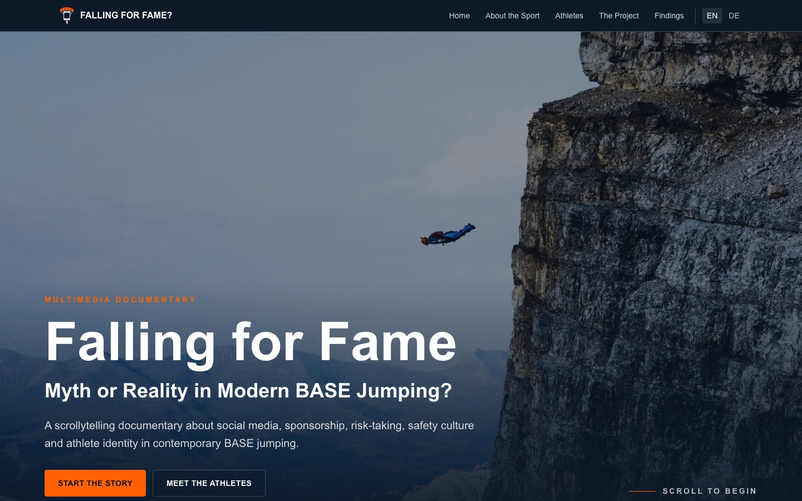
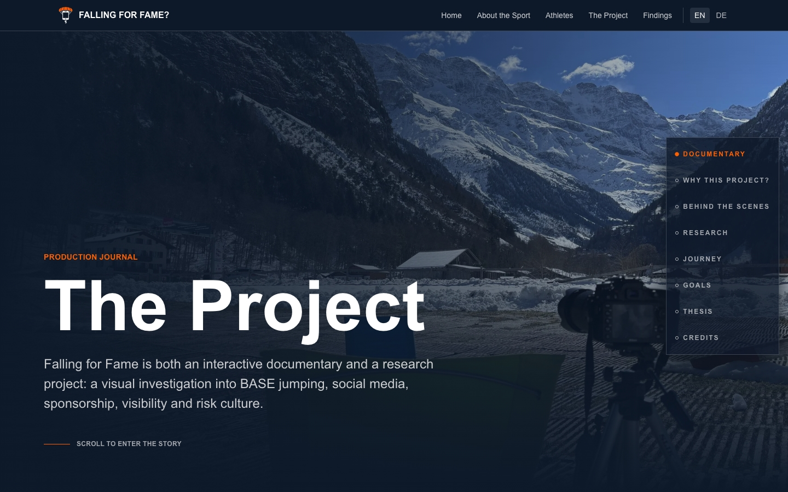
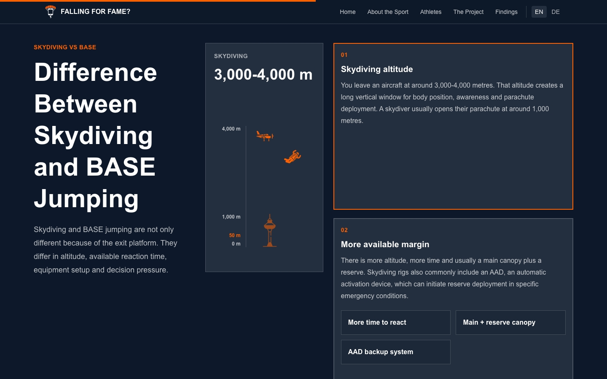

# Falling for Fame?

**Myth or Reality in Modern BASE Jumping?**

GitHub: https://github.com/jonasteuscher/fallingforfame  
Website: https://fallingforfame.com

*Falling for Fame?* is a bilingual Next.js App Router web documentary exploring
how social media, visibility, sponsorship, risk-taking, safety culture,
community norms and athlete identity influence modern BASE jumping.

Built as the practical component of a Bachelor thesis, the project combines
immersive scrollytelling with qualitative research communication. German and
English versions share the same implementation while preserving localized
content, metadata and routing.

## Overview

The project combines:

- multimedia storytelling
- documentary filmmaking
- interactive web technologies
- qualitative research communication

It translates the findings of the accompanying Bachelor thesis into an
accessible, interactive experience.

### Screenshots

<table>
  <tr>
    <td>
      
    </td>
    <td>
      
    </td>
    <td>
      
    </td>
  </tr>
  <tr>
    <td align="center">Home</td>
    <td align="center">Project</td>
    <td align="center">About the Sport</td>
  </tr>
</table>

## Relation to the Bachelor Thesis

This repository contains the practical implementation of the project. The
written Bachelor thesis contains the scientific background, methodology,
analysis, discussion and academic context.

The web documentary communicates the research findings to a broader audience
through interactive storytelling. Both projects were developed together, but
they fulfil different purposes: the thesis provides the scientific argument,
while the website translates the topic into a public-facing documentary
experience.

## Architecture

The application is built with the Next.js App Router and uses static generation
where possible. The architecture is content-driven: structured content,
localized copy and media references are separated from presentation components.

Core architectural principles:

- Next.js App Router
- static generation where possible
- reusable documentary components
- typed content models
- locale-based routing
- content-driven rendering
- separation between content and presentation

Athlete pages are generated from structured data in `src/data/athletes.ts`
instead of individual page implementations. This keeps the athlete stories
consistent while still allowing each profile to define its own media, order,
sections and narrative rhythm.

## Features

- bilingual experience
- localized routing
- scrollytelling
- athlete documentary pages
- synchronized audio experiences
- interactive findings visualization
- responsive layouts
- accessibility-focused implementation
- SEO-optimized metadata
- reusable component architecture

## Tech Stack

- Next.js 16 App Router
- React 19
- TypeScript
- Tailwind CSS 4
- Vitest and Testing Library
- Next Image Optimization
- ESLint
- Prettier
- Vercel

## Content Pipeline

Presentation is separated from content. The main content sources are:

- structured athlete data
- localized text content
- reusable documentary modules
- media assets

This architecture allows content updates without changing presentation logic.
Localized page copy lives in `src/content`, athlete-specific page structures
live in `src/data/athletes.ts`, and reusable modules in `src/components` render
the documentary experience.

## Design System

Consistency is achieved through shared components rather than page-specific
implementations. The design system is defined through global styles, reusable
layouts and shared documentary modules.

It includes:

- typography tokens
- spacing system
- reusable layouts
- animation behaviour
- responsive rules
- shared athlete template

## Development

```bash
npm install
npm run dev
```

Useful commands:

```bash
npm run lint
npx tsc --noEmit
npm run test
npm run build
npm run format:check
```

`npm run build` runs linting and the full test suite before the production
Next.js build.

## Deployment

Deployment is handled through Vercel. Production deployments are generated from
the main branch, while preview deployments are used during development and
review.

Production URL: https://fallingforfame.com

## Routes

The site uses locale-prefixed routes:

```text
/
/en
/en/athletes
/en/athletes/[slug]
/en/findings
/en/sport
/en/project
/en/imprint

/de
/de/athletes
/de/athletes/[slug]
/de/findings
/de/sport
/de/project
/de/impressum

/sitemap.xml
```

The root route redirects to the default English locale. Unknown routes render a
custom bilingual 404 page and return a real HTTP 404 status.

## Project Structure

```text
src/
  app/
    page.tsx                  Root redirect to the default locale
    layout.tsx                Global metadata and styles
    globals.css               Global CSS, colour tokens and motion fallbacks
    not-found.tsx             Global 404 fallback
    sitemap.ts                Generated sitemap
    [locale]/                 Localized App Router segment
      layout.tsx              Locale validation and shared page chrome
      not-found.tsx           Locale-aware 404 UI
      page.tsx                Localized homepage
      athletes/               Athlete overview and detail routes
      findings/               Findings page
      sport/                  About the Sport page
      project/                About the Project page
  components/
    athletes/                 Shared athlete documentary modules
    audio/                    Audio context and playback coordination
    layout/                   Header, navigation and footer
    media/                    Video and media rendering components
    scrollytelling/           Reusable longform story elements
    ui/                       Small generic UI components
  content/
    en/                       English page copy
    de/                       German page copy
  data/
    athletes.ts               Structured athlete profile and page data
  i18n/                       Locale config, dictionaries and URL helpers
  lib/                        Shared utilities
  types/                      Shared TypeScript content and media types
tests/
  integration/                Page and navigation integration tests
  unit/                       Component and data unit tests
docs/
  athlete-page-reference.md   Athlete page architecture rules
public/
  images/                     Static image assets
  audio/                      Static audio assets
  video/                      Static video assets
```

## Internationalisation

Supported locales are defined in `src/i18n/config.ts`.

Page copy is split by locale and page:

```text
src/content/en/home.ts
src/content/en/sport.ts
src/content/en/athletes.ts
src/content/en/project.ts
src/content/en/findings.ts

src/content/de/home.ts
src/content/de/sport.ts
src/content/de/athletes.ts
src/content/de/project.ts
src/content/de/findings.ts
```

`src/content/en/site.ts` and `src/content/de/site.ts` aggregate the page files
into the dictionary shape consumed by `getDictionary(locale)`.

Use `localizedPath(locale, path)` for internal links so navigation always stays
inside the active language.

## Athlete Pages

Tim Howell and Lukas Loibl are the reference pages for design, interaction,
storytelling rhythm and implementation quality.

All athlete detail pages must render through the shared `AthletePage` template
exported from `src/components/athletes`. Athlete-specific content and page
composition live in `src/data/athletes.ts`.

The route must not contain athlete-specific JSX trees or slug-based layout
branches. Intentional differences belong in typed data:

```ts
page: {
  navAriaLabel: { en: "...", de: "..." },
  progress: [
    { id: "career", label: { en: "Career", de: "Karriere" } },
  ],
  sections: [
    {
      id: "planning-comes-first",
      type: "interview-video",
      featureId: "planning-comes-first",
      layout: "text-first",
      spacing: "immersive",
      includeInProgress: true,
    },
  ],
}
```

Supported section types include interview video, audio story, scroll video,
project feature, gallery, social links and media coverage. New section types
should only be added when the content cannot be represented by an existing
shared module.

Read the full reference before adding or changing athlete pages:

```text
docs/athlete-page-reference.md
```

## Media

Large media assets are stored inside the `public` directory so they can be
served as static assets.

The project includes:

- interviews
- documentary photography
- ambient audio
- background videos
- scrollytelling videos

Media assets are part of the documentary experience and are not automatically
covered by any source-code license.

## SEO And Routing

- Public localized pages are listed in `src/app/sitemap.ts`.
- 404 pages use `robots: noindex, nofollow`.
- The 404 page is not part of navigation or the sitemap.
- Route metadata is implemented with the Next.js Metadata API where page-level
  metadata is needed.

## Browser Support

The documentary is optimized for modern evergreen browsers:

- Chrome
- Edge
- Firefox
- Safari

Desktop provides the intended scrollytelling experience. Mobile devices receive
an adapted experience for smaller screens and touch interaction.

## Accessibility And Performance Baseline

Keep the documentary UI accessible and stable:

- one `h1` per page
- semantic section headings
- non-heading eyebrow labels
- keyboard-visible focus states
- accessible media controls
- reduced-motion support
- reserved image and media dimensions
- lazy loading for below-the-fold media
- only hero media should be priority loaded

For athlete pages, validate at least:

```text
390 x 844
768 x 1024
1440 x 1000
1920 x 1080
```

## Performance

The implementation aims to keep the documentary performant despite large media
assets and scroll-based interactions.

Performance measures include:

- static generation where appropriate
- optimized images
- lazy loading
- responsive media
- minimized client-side JavaScript where possible

## Testing

The current test suite covers page rendering, navigation, shared athlete modules,
media behaviour, audio waveform behaviour, 404 rendering and structured athlete
data.

Run before handing off changes:

```bash
npm run lint
npx tsc --noEmit
npm run test
npm run build
```

## Known Limitations

- The intended experience is desktop-first.
- Large media files benefit from fast internet connections.
- Some interactions are simplified on smaller devices.

## Notes For Future Work

- Keep shared design and interaction behaviour in reusable components.
- Keep athlete stories, ordering and media in typed data.
- Do not add placeholder sections for missing athlete content.
- Avoid slug checks in shared components.
- Preserve static/SSG output where possible.

## License

The source code in this repository is licensed under the MIT License. See the
[LICENSE](LICENSE) file for the full license text.

This license applies **only** to the software source code.

All photographs, videos, audio recordings, interview material, graphics,
logos and other media assets are **excluded** from the MIT License unless
explicitly stated otherwise. These materials remain the intellectual property
of their respective creators and may not be copied, redistributed or reused
without prior written permission.
